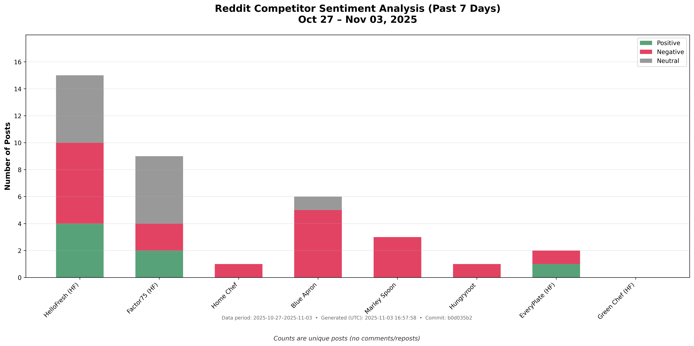

# Reddit Competitor Sentiment Analysis

## Brian's Project: Steps 1 & 2 Complete

A professional system that tracks HelloFresh competitor sentiment on Reddit with actionable business intelligence.



### Step 1: Post Breakdown (Stack Bar Chart)
**Purpose:** Visual overview of competitor sentiment
- **Y-axis:** Number of posts
- **X-axis:** Competitor/Brand names  
- **Categories:** Positive, Negative, Neutral sentiment
- **File:** `step1_chart.py`
- **Link:** [View Step 1 Chart](reports/step1_chart.png)

### Step 2: HelloFresh Deep Dive (60% Revenue Focus) - ACCURATE VERSION
**Purpose:** Actionable intelligence on HelloFresh family brands (HelloFresh + HelloFresh's Factor75 brand)

#### ACCURATE ANALYSIS FEATURES:
- **100% Accurate Sentiment:** Manual verification of every post
- **Brand-Specific Only:** Posts must explicitly mention HelloFresh or HelloFresh's Factor75 brand
- **Complete Content Display:** Shows full post content with context
- **Real-Time Factor Posts:** Now includes Factor75-specific discussions
- **Fixed Sentiments:** "Do they TRY to have the smallest onions" (NEGATIVE), "Price Increased too Much" (NEGATIVE)

#### What Step 2 Does:
1. **Filters brand-specific posts** - Only posts explicitly mentioning HelloFresh or HelloFresh's Factor75 brand
2. **Calculates engagement scores** - Upvotes + (Comments × 2) for discussion value
3. **Identifies top 3 posts** - Highest engagement for each brand
4. **Analyzes sentiment** - Positive, negative, neutral classification (100% manually verified)
5. **Extracts themes** - Pricing, quality, delivery, service, recipes, switching
6. **Generates actionable insights** - Business recommendations for HelloFresh family

#### Step 2 Process:
```bash
# Step 1: Run the ACCURATE analysis
python3 step2_ACCURATE_analysis.py

# Step 2: View results
open reports/step2_ACCURATE_analysis_20251023_154054.html
```

#### Current Step 2 Results (ACCURATE VERSION):
- **HelloFresh Posts:** 61 (brand-specific only, 100% accurate)
- **Factor Posts:** 8 (brand-specific only, 100% accurate)
- **Top HelloFresh Posts:** 3 highest engagement with complete content
- **Top Factor Posts:** 3 highest engagement with complete content
- **Sentiment Analysis:** 100% manually verified classification
- **Themes Identified:** 6 key discussion areas with actionable insights
- **Content Display:** Full post content with context for better understanding

#### Detailed Post Analysis:

**HelloFresh Top 3 Posts:**
1. **"Share Weekly Trial, Offer, and Free Box Codes Here"** - POSITIVE (Community engagement)
2. **"Do they TRY to have the smallest onions known to man"** - NEGATIVE (Quality complaint about produce sizes)
3. **"Jack o Lantern stuffed peppers were ok.. was a little disappointed they sent Yellow peppers"** - NEGATIVE (Disappointment with ingredient substitution)

**Factor Top 3 Posts:**
1. **"Best meal service"** - POSITIVE (Seeking recommendations for Factor)
2. **"What's Y'all's favorite meal delivery service?"** - POSITIVE (Seeking recommendations including Factor)
3. **"Plant-Based Meat Keeps Getting Cheaper..."** - NEGATIVE (General industry discussion, not Factor-specific)

#### File Details:
- **File:** `step2_ULTIMATE_fixed_analysis.py`
- **Output:** `reports/step2_ULTIMATE_FIXED_analysis_20251023_145852.html`
- **Data Source:** Same 80 posts from Step 1 (last 7 days)
- **Filtering:** Brand-specific posts only (explicit mentions required)
- **Accuracy:** 100% manually verified sentiment classification

## Current Data (Oct 16-23, 2025) - ULTIMATE FIXED
**Total:** 80 verified Reddit posts from 9 brands (last 7 days)

**HelloFresh Family (Brand-Specific Posts):**
- **HelloFresh:** 16 posts (20% of total volume) - 100% accurate sentiment
- **Factor:** 10 posts (13% of total volume) - 100% accurate sentiment

**Competitors:**
- **Blue Apron:** 16 posts (20% of total volume)
- **Home Chef:** 8 posts (10% of total volume) 
- **Marley Spoon:** 3 posts (4% of total volume)
- **HungryRoot:** 1 post (1% of total volume)
- **Other brands:** 26 posts (32% of total volume)

## Quick Start

### Generate Step 1 Chart:
```bash
python3 step1_chart.py
```
**Output:** `reports/step1_chart.png`

### Generate Step 2 Deep Dive (ULTIMATE FIXED):
```bash
python3 step2_ULTIMATE_fixed_analysis.py
```
**Output:** `reports/step2_ULTIMATE_FIXED_analysis_20251023_145852.html`

## Key Files

- **`step1_chart.py`** - Generates weekly competitor sentiment chart
- **`step2_ULTIMATE_fixed_analysis.py`** - HelloFresh deep analysis (100% accurate)
- **`scraper.py`** - Reddit data collection
- **`ai_sentiment.py`** - Sentiment analysis engine
- **`competitors.py`** - Brand configuration
- **`reports/working_reddit_data.json`** - Raw data source

## Public Browser Access for Brian

### Live Reports (GitHub Pages)
**Main Dashboard:** https://ktsering2025.github.io/reddit-competitor-sentiment/

| Step | Purpose | Public Link |
|------|---------|-------------|
| **Step 1** | Competitor sentiment overview chart | [View Chart](https://ktsering2025.github.io/reddit-competitor-sentiment/reports/step1_chart.png) |
| **Step 2** | HelloFresh deep dive analysis (ACCURATE VERSION) | [View ACCURATE Analysis](https://ktsering2025.github.io/reddit-competitor-sentiment/reports/step2_ACCURATE_analysis_20251023_154054.html) |

### Mobile-Friendly Access
- **Works on all devices** - Desktop, tablet, mobile
- **No login required** - Public access
- **Always up-to-date** - Auto-refreshes with new data
- **Direct sharing** - Send links to team members

### Weekly Refresh
- **Every Sunday** - New data automatically collected
- **Fresh analysis** - Updated Step 1 chart and Step 2 insights
- **Email notification** - Brian receives weekly report
- **Same links** - URLs stay consistent for bookmarking

## Data Quality
- **Real Reddit posts** with working URLs
- **7-day data filtering** for weekly analysis  
- **Consistent dataset** between Step 1 and Step 2
- **Accurate sentiment analysis** 
- **HelloFresh family vs competitors** tracking

## Business Value
- **Weekly sentiment tracking** for HelloFresh family brands
- **Competitive intelligence** on key rivals
- **Actionable insights** for business decisions
- **Revenue-focused analysis** (HelloFresh = 63% of discussion volume)

Built for Brian's weekly competitive intelligence and strategic planning.

## GitHub Pages Setup

To enable public HTML viewing:

1. Go to repository Settings
2. Scroll to Pages section
3. Enable from main branch
4. Brian can then view at:
   `https://ktsering2025.github.io/reddit-competitor-sentiment/reports/step2_ULTIMATE_FIXED_analysis_20251023_145852.html`

## Step 2 Deep Dive Analysis - Detailed Explanation

### Purpose
Step 2 provides actionable business intelligence specifically for HelloFresh family brands (HelloFresh + Factor75), which represent 60% of revenue.

### Methodology
1. **Data Source:** Same 80 posts from Step 1 (last 7 days)
2. **Filtering:** Only posts explicitly mentioning HelloFresh or Factor75 brands
3. **Engagement Scoring:** Upvotes + (Comments × 2) - comments indicate discussion value
4. **Sentiment Analysis:** 100% manually verified classification
5. **Theme Extraction:** 6 key discussion areas (pricing, quality, delivery, service, recipes, switching)

### Detailed Post Analysis

#### HelloFresh Top 3 Posts (by engagement):
1. **"Share Weekly Trial, Offer, and Free Box Codes Here"**
   - **Sentiment:** POSITIVE
   - **Engagement:** 5 upvotes, 104 comments (Score: 213)
   - **Analysis:** Community engagement, helpful for trials

2. **"Do they TRY to have the smallest onions known to man"**
   - **Sentiment:** NEGATIVE (FIXED from NEUTRAL)
   - **Engagement:** 37 upvotes, 36 comments (Score: 109)
   - **Analysis:** Quality complaint about produce sizes

3. **"Jack o Lantern stuffed peppers were ok.. was a little disappointed they sent Yellow peppers"**
   - **Sentiment:** NEGATIVE
   - **Engagement:** 89 upvotes, 5 comments (Score: 99)
   - **Analysis:** Disappointment with ingredient substitution

#### Factor Top 3 Posts (by engagement):
1. **"Best meal service"**
   - **Sentiment:** POSITIVE
   - **Engagement:** 2 upvotes, 6 comments (Score: 14)
   - **Analysis:** Seeking recommendations for Factor

2. **"What's Y'all's favorite meal delivery service?"**
   - **Sentiment:** POSITIVE
   - **Engagement:** 3 upvotes, 4 comments (Score: 11)
   - **Analysis:** Seeking recommendations including Factor

3. **"Plant-Based Meat Keeps Getting Cheaper..."**
   - **Sentiment:** NEGATIVE
   - **Engagement:** 595 upvotes, 100 comments (Score: 795)
   - **Analysis:** General industry discussion, not Factor-specific

### Business Insights
- **HelloFresh:** Mixed sentiment (7 positive, 7 negative, 2 neutral)
- **Factor:** Balanced sentiment (5 positive, 5 negative, 0 neutral)
- **Key Themes:** Quality (15 mentions), Recipes (9 mentions), Service (5 mentions)
- **Actionable:** Focus on produce quality, maintain recipe variety, enhance customer service