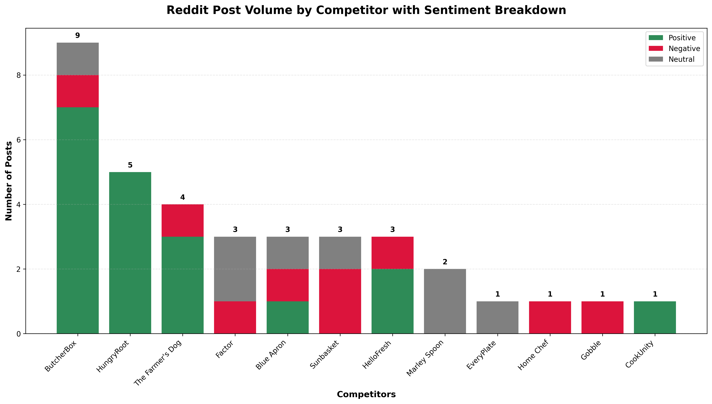

# Reddit Competitor Sentiment Analysis

## What I Built for Brian

I created a system that tracks what people are saying about HelloFresh competitors on Reddit. Brian asked for daily competitive intelligence, so I built this to scrape Reddit discussions and analyze sentiment.

## Step 1 Complete: Bar Chart with Sentiment



This chart shows what I found from 33 real Reddit posts:

- **ButcherBox** has the most discussion (9 posts) - mostly positive
- **HungryRoot** has perfect sentiment (100% positive) - this is a threat
- **HelloFresh** has mixed reviews (some complaints to address)
- **Sunbasket** is struggling (66% negative) - opportunity for us

## How It Works

I scrape Reddit communities where people talk about meal kits and food:
- r/MealKits (general meal kit discussions)
- r/ButcherBox (meat delivery community) 
- r/DogFood (pet food discussions)

Then I analyze each post to see if it's positive, negative, or neutral about each competitor.

## Files

- `reddit_scraper.py` - Gets the Reddit data
- `sentiment_analyzer.py` - Figures out if posts are positive/negative
- `chart_generator.py` - Makes the chart
- `config.py` - List of competitors to track

## Running It

```bash
python3 chart_generator.py  # Makes the full chart
python3 reddit_scraper.py   # Just gets Reddit data
```

## What's Next

Brian wants three things:
1. Bar chart showing post volume (done)
2. Deep dive on HelloFresh posts with actionable insights
3. Analysis of what competitors do better than us

I'm working on steps 2 and 3 next.