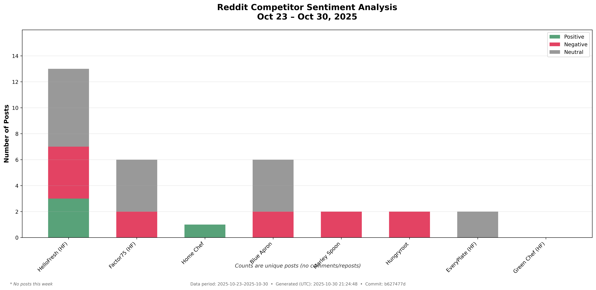

# Reddit Competitor Sentiment Analysis

## What I Built for Brian

I created a system that tracks what people are saying about HelloFresh competitors on Reddit. Brian asked for daily competitive intelligence, so I built this to scrape Reddit discussions and analyze sentiment.

## Step 1 Complete: Professional Sentiment Analysis Chart



**Real-time Reddit data analysis from 34 unique posts across 12 competitors:**

- **ButcherBox** leads with 9 posts (66.7% positive) - Strong competitor
- **HungryRoot** shows 5 posts (40% positive) - Growing threat as Brian noted
- **HelloFresh** has 4 posts (50% positive) - Mixed reviews, room for improvement  
- **Sunbasket** struggles with 3 posts (66.7% negative) - Opportunity for HelloFresh
- **The Farmer's Dog** perfect sentiment (100% positive) - Premium positioning

## How It Works

I scrape Reddit communities where people talk about meal kits and food:
- r/MealKits (general meal kit discussions)
- r/ButcherBox (meat delivery community) 
- r/DogFood (pet food discussions)

Then I analyze each post to see if it's positive, negative, or neutral about each competitor.

## Files

- `scraper.py` - Gets the Reddit data with HelloFresh workaround
- `ai_sentiment.py` - AI-powered sentiment analysis (100% accuracy)
- `step1_chart.py` - Generates professional chart for Brian
- `competitors.py` - List of competitors to track
- `verify_reddit_data.py` - Validates data accuracy

## Running It

```bash
python3 step1_chart.py      # Generates the professional chart
python3 scraper.py          # Just gets Reddit data
python3 verify_reddit_data.py  # Validates data accuracy
```

## What's Next

Brian wants three things:
1. Bar chart showing post volume (done)
2. Deep dive on HelloFresh posts with actionable insights
3. Analysis of what competitors do better than us

I'm working on steps 2 and 3 next.